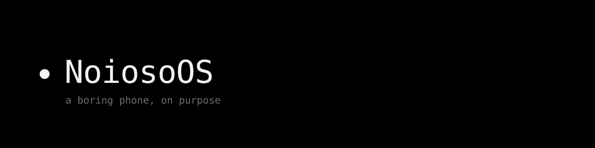

# NoiosoOS

  

  <a href="https://gam1ngn0tdev.github.io/NoiosoOS/">Website</a> ·
  <a href="https://github.com/GaM1ngN0tDev/NoiosoOS/blob/main/LICENSE">License</a> ·
  <a href="#how-to-contribute--support">Contribute</a>

  
  

> A minimalist, privacy-first Android operating system built to protect your data and save you from screen addiction.

Modern smartphones are engineered to hijack your attention. **NoiosoOS** (Italian for *"boring OS"*) is designed to do the exact opposite. It gives you your time back through aggressive, hard-coded social media limits and a clean, distraction-free interface.

🚧 **Project status:** work in progress. Due to current hardware limitations, full OS compilation is on pause — development is currently focused on the custom, preinstalled application suite.

---

## Why NoiosoOS?

The concept started with a simple rule to fight mindless scrolling: **the 10+5 rule.**

By default, NoiosoOS strictly limits your daily social media usage to **10 minutes**. If you absolutely need more, you can request a final **5-minute extension**. Once those 15 total minutes are up, NoiosoOS locks you out of social apps for the rest of the day — no overrides, no loops. You wait until tomorrow.

Combined with an integrated minimalist launcher, NoiosoOS turns your phone back into a utility tool, not an attention trap.

---

## The preinstalled app suite

To keep a cohesive, distraction-free aesthetic, NoiosoOS replaces standard bloated apps with heavily optimized, Material 3 AOSP variants and custom utilities.

### Core utilities
* **NoiosoTime** *(work in progress)*  the core system engine. Acts as a digital "ticking time bomb" for social apps, enforcing the 10+5 minute daily lockout rule.
* **NoiosoHome** *(beta, ready to try)*  the default minimalist launcher. Black background, white text, core apps front and center, everything else sorted by usefulness instead of the alphabet.
* **NoiosoPhone** *(work in progress, ready to try)*  dial pad, contacts, call log, and a full in-call screen, built so it can be set as your default phone app.
* **NoiosoStore** *(work in progress)* a privacy-respecting app repository. Designed similarly to Aurora Store: fetch open-source apps and your essential Google Play apps without the tracking, while encouraging mindful downloading.

### Everyday tools
* **Browser** a lightweight, Chromium-based browser stripped down to a minimal, distraction-free layout.
* **Messages** built on AOSP foundations, refreshed with Material 3 design.
* **Settings** a streamlined version of the Android settings app, tucked away so you spend less time tweaking options.
* **Camera & Gallery** clean, tracker-free AOSP multimedia tools that focus purely on capturing and viewing your memories, no cloud bloat.
* **Timer & Podcast** simplified utilities for your daily routine, with no algorithmic recommendations pushed at you.

Every app you see here is open source, in this repo. You're welcome to use it — just check the [Apache License 2.0](https://github.com/GaM1ngN0tDev/NoiosoOS/blob/main/LICENSE) first.

---

## How to contribute & support

I currently **lack the high-powered machine and disk space needed to compile full Android ROM builds**, so help from the open-source community is very welcome.

If you're an Android developer, ROM maintainer, or designer, you can help by:
1. Contributing to the standalone app repositories (like `NoiosoHome` and `NoiosoPhone`).
2. Helping set up automated GitHub Actions/CI pipelines to build the system images remotely.
3. Translating the launcher and app UI strings into other languages.

I'm still figuring out the visual language for the rest of the system, ideas and design feedback welcome too.

---

## License

This project is open source, distributed under the [Apache License 2.0](https://github.com/GaM1ngN0tDev/NoiosoOS/blob/main/LICENSE).
